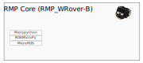

## ROSMicroPy
ROSMicroPy is an integration of Micropython and MicroROS providing full access to ROS environment along with native Micropython type support for ROS.

ROSMicroPy has two goals.
* Provide a modular platform based on the ROS robotics with an easier learning curve to get started but also allows for future expansion into real world industrial robotics.

* Expand on the idea of modular robotics where a robot can consist of many distributed compute modules that are organized into a single heterogenous interface using the "RollCall" protocol. The goal here is to allow robots to be assembled from many nodes, giving it more of a lego assembly feel, and having a Controller / IDE seeing all those nodes as a single robot control / programming interface.

* #### [Get Started](docs/LearnMore.md)
* #### [Learn more about the core SDK](docs/rosmicropy-sdk/README.md)
* #### [Learn more about MicroROS Type support](docs/rosmicropy-sdk/docs/mp_uros_dataTypeParser.md)
* #### [Python Example Code](./python_example_code/README.md)

### Current Build Profiles supported by ROSMicroPy

The core stack provides the basic functionality of a ROS enabled Micropython node  

From it's core configuration, there are other ROSMicroPy modules that can be configured to provide additional functionality. 

The **LCD Controller** introduces to new modules;

***ROSMicroPy-GUI***, is a [JSON Forms](https://jsonforms.io/) renderer for LVGL that allows for a Web based GUI layout designer to produce a JSON description of a screen layout that can be saved on a ROSMicroPy device.

***ROSMiicroPy-JoyCom***, is a Bluetooth HID Central Server, that makes the inputs of a JoyCon device available for the ROSMicroPy environment. 

***ROSMicroPy-CAM*** module allows an ESP32 Cam to publish a video stream in ROS format that can be received by another ROSMicroPy or other ROS enabled device. As images are pulled from the Camera, they are passed to the Python layer to be sent out as a ROS message or allow it to be analyzed by an image processing library such as [YOLO](https://www.kdnuggets.com/2018/09/object-detection-image-classification-yolo.html)
