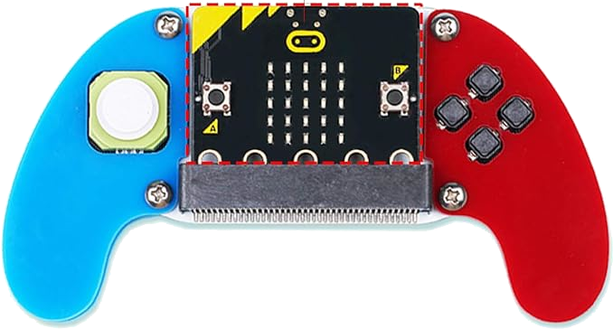

# ROSMicroPy LCD Controller.

## Problem Statement
Using the ROSMicroPy firmware on an MBits ESP32 controller, for both the JoystickBit and the Maqueen Turtlebot work well to produce a cost effective ROS based robotic learning system. Although the JoystickBit has sufficient but limited functionality for expansion. 
<table>
 <tr>
  <td style="width:50%">
   
  </td>
  <td style="width:50%">
    
  </td>
</tr>
</table>

A remote control unit that incorperatres an LCD along with the Joystick functionality where the LCD screen can provide a far greater range than the JoystickBit. i.e. Attach a streaming video feed to a ROS video widget and allow the user to see what the robot sees. 

## Proposed solution
There is a growing popularity of LCD screens with build in ESP32 controllers that cost around $30 now. Just the screen by itself could be a decent controller with soft buttons. Adding on JoyCons further expand the functionality and start to present a form factor that is much more familiar to the end user.

### Reference
* [LCD Display](https://www.aliexpress.us/item/3256804913729039.htm)

* [Joycons](https://www.amazon.com/eXtremeRate-Handheld-Controller-Housing-Replacement/dp/B07MKV3FK8/)

* [Mounting Rails](https://www.amazon.com/Deal4GO-Bracket-Replacement-Nintendo-Console/dp/B07NXXPKHB)

* [Charging Cables](https://www.amazon.com/D-Gruoiza-Portable-Charger-Controller-Charging/dp/B0CB84ZMM5)

## How it would work

Add support for LVGL and the touch controller to the ROSMicroPy codebase and provide the correct Python functions to drive the display

Develop a data driven layout manager that could allow form design to happen locally on a PC/Laptop, that can be transfered easilly to the device so that the screen can be rendered and button actions / ROS events can automatically be mapped by name reference.

Currently evaluating [JSON Forms](https://jsonforms.io/) as a platform to work with. Most Screen development IDE's write code as you create the layout.  JSON forms describes the screen, all the buttons, actions and other widgets, whcih is later rendered by a screen renderer. This allows the Screen layout to be rendered depending how it was implemented. A Web based IDE would use the React renderer or a Thonny plugin could use the TKinter renderer, any once the screen definition is produced an LVGL renderer will bring the screen to life on the device. 

### Screen Builder IDE's
* [JSON Forms Editor](https://jsonforms-editor.netlify.app)
* [Form.io's Aurelia editor](https://github.com/formio/aurelia-formio) see [Demo](https://formio.github.io/aurelia-formio/)

