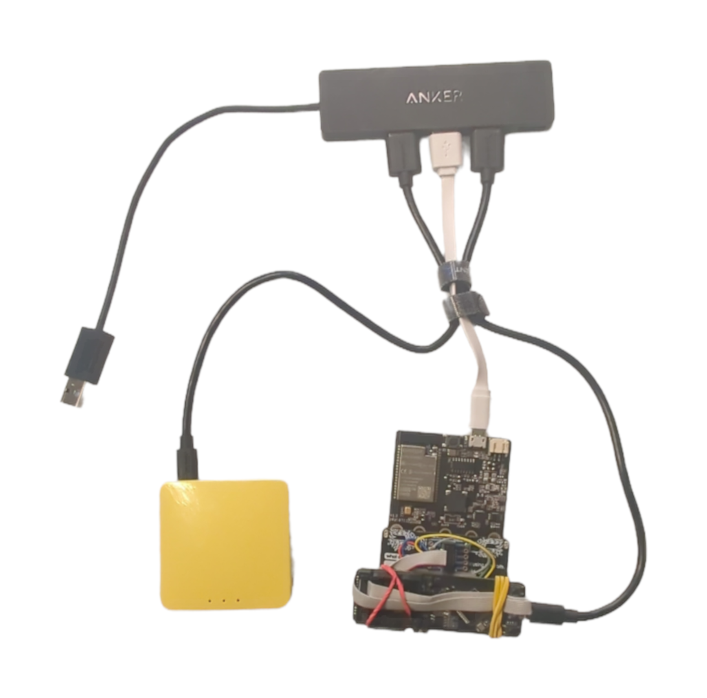

 
# Component Diagram 
The component diagram below depicts how the containers interact with each other. 

A USB powered router is helpful in that it provides a pre-determined network configuration that will work consistently
+ The router allows you to define static IP address to the nodes to provide consistent configuration when you are setting IP addresses 
+ The router can also attach to an outgoing access point so the nodes can route traffic to the internet as well as talk to each other.

The diagram below shows a real work implementation. Here the JTag debugger is tied to the board under test which is an [MBits board by Elecrow](https://www.aliexpress.us/item/3256803353734572.html), an ESP32 variant of the [MicroBit board](https://microbit.org)

Microbit is an easily expandable platform that is targeted towards young programmers and has very good support. 

There are several [add-on boards](https://www.aliexpress.us/w/wholesale-microbit-extension-board.htm) that make it very easy attach to other devices such as a JTag debugger.

[  **Phyiscal Setup**]( ../images/PhyiscalDevSetup2.png  )
