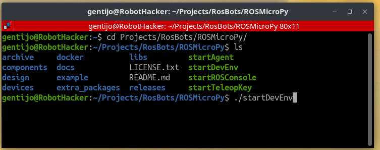
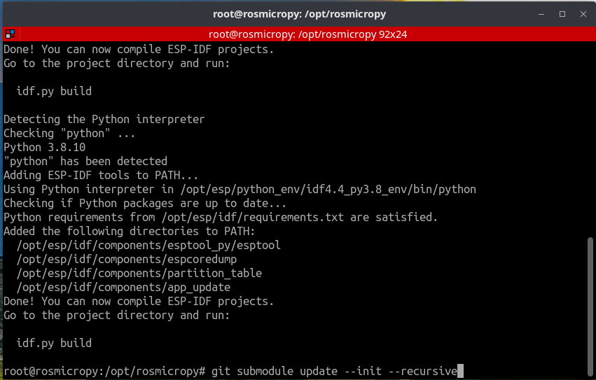

# Creating the Development Environment container

## Overview
 The Development Environment is a container that has pre-installed and configured all the development tools that are needed to Compile, Flash and Monitor a ROSMicroPy device.

## Requirements
+ Computer with Docker installed
+ A terminal program to give you command line access. 
+ Its helpful if you have a terminal program that will multiple sessions in one window. This saves on space and allows you to collapse all of your container sessions as a single operation.

## How to Build
 + Change your working directory to be where you checked out the ROSMicroPy repository.
 + Run the shell script, startDevEnv, this will build then run the container.
 + You can either work from the command line once the container launches, or use Visual Studio code attach to the running container via Remote Explorer and have a full IDE that will give you command line access and be able to easily transfer files.
 + The current working directory will automatically be mounted to the running container and will be present at **/opt/rosmicropy**

 + **Here is an example of a terminal running on the host system would look like when you want to run the container.** 
   + If you are using VS Code, you no longer need to run the startDevEnv script as VSCode will auto start and attach to the container. 

[  ]( ../images/DevEnv_StartBuild.png )


**When the build is complete you will have a shell prompt in your container at the project directory inside the container**

[  ]( ../images/DevEnvBuild.png )

**The first time you are using your Dev Env container, you need to initialize and update all the submodules of the project by running** 

`git submodule update --init --recursive` 

[  ]( ../images/DevEnvStep1.png )

### To attach to VS Code, install VSCode along the following VS Code extensions
 + Remote Explorer 
 + Remote Development
 + Dev Containers


**Open VSCode and select Remote Explorer, you should see the rosmicropy container**
 
[  ]( ../images/DevEnv_RemExp.png )

### Opening your workspace folder

 + Attach to the container then use the Open Folder command to open */opt/rosmicropy***
 + Your Repo files should now be visible in the explorer


[  ]( ../images/DevEnv_VS_Term.png )

### How to compile the code

+ From your project directory, cd to the devices/mbits-esp32s2-wrover directory
+ This device should support all of the esp32s2 SoC chips

#### Run the compile process by running the ./compile shell script

[  ]( ../images/DevEnv_VSC_compile.png )

#### On a successful compile you should see the following message


```
Successfully created esp32 image.
Generated /opt/rosmicropy/devices/mbits-esp32s2-wrover/build/mbits-esp32s2-wrover.bin
[21/21] cd /opt/rosmicropy/devices/mbits-esp32s2-wrover/build/esp-idf/esptool_py && /opt/esp/python_env/idf4.4_py3.8_env/bin/python /opt/esp/idf/components/partition_table/check_sizes.p...0 partition --type app /opt/rosmicropy/devices/mbits-esp32s2-wrover/build/partition_table/partition-table.bin /opt/rosmicropy/devices/mbits-esp32s2-wrover/build/mbits-esp32s2-wrover.bin
mbits-esp32s2-wrover.bin binary size 0x18e000 bytes. Smallest app partition is 0x1f0000 bytes. 0x62000 bytes (20%) free.

Project build complete. To flash, run this command:
/opt/esp/python_env/idf4.4_py3.8_env/bin/python ../../../esp/idf/components/esptool_py/esptool/esptool.py -p (PORT) -b 460800 --before default_reset --after hard_reset --chip esp32  write_flash --flash_mode dio --flash_size detect --flash_freq 40m 0x1000 build/bootloader/bootloader.bin 0x8000 build/partition_table/partition-table.bin 0x10000 build/mbits-esp32s2-wrover.bin
or run 'idf.py -p (PORT) flash'
```

### Flashing your device

Attach your ESP32 device to a serial port and run

`./flash`

This should load code into your device. 

#### [Follow the instructions to set up your Python dev Env to start running code](../procudures/pythonDeveloperEnvironment.md)


### A note about different Operating Systems
This should work out of the box for Mac or Linux and Windows with WSL2 installed
Your milage may vary with non-WSL2 Windows and is out of scope for this project
