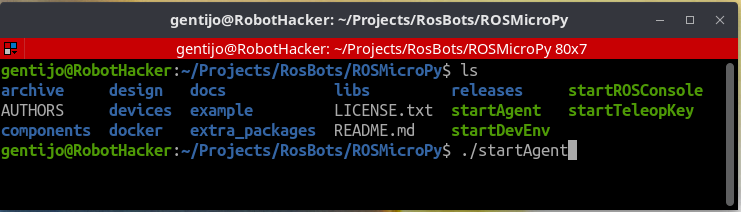
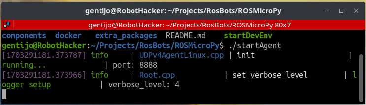

# Creating a container to run the MicroROS Agent

## Overview
 The ROS Agent is the controller that manages message passing from the MicroROS network to the larger ROS network, it also manages messages between MicroROS devices.

## Requirements
+ Computer with Docker installed
+ A terminal program to give you command line access. 
+ Its helpful if you have a terminal program that will multiple sessions in one window. This saves on space and allows you to collapse all of your container sessions as a single operation.

## How to Build
 + Change your working directory to be where you checked out the ROSMicroPy repository.
 + Run the shell script, startAgent, this will build then run the container.
 

 + You should see the log output from the agent

 

