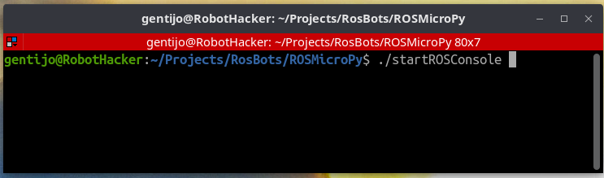
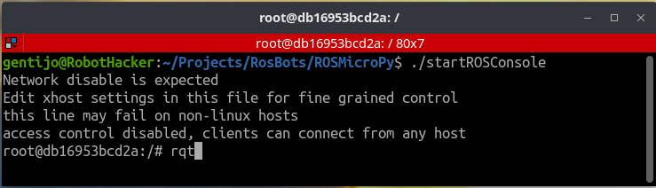
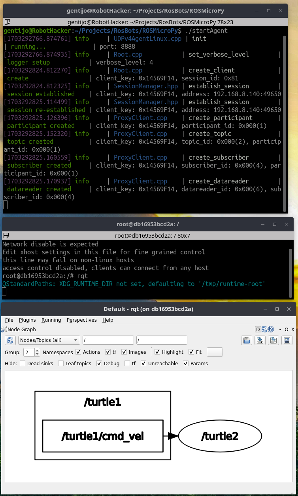

# Creating a container to run the ROS Console 
 This is a specialized container that will allow the user to run ROS graphical apps by utilizing a connection to the Hosts XWindowing System

+ For Linux
    - This should run out of the box, no special attention required
 
+ For Mac
    - You will need to verify that XQuartz is installed. XQuartz is EOL but you can still find it.
 
 + For Windows
    - With WSL2 Ubuntu Installed
        - An XWindows server needs to be installed
        - The Repo and containers run from a Linux Terminal
        - Docker and Thonny are installed on the Windows side

    - On plain Windows
        - Good luck, will need some love and care. - One of the larger issues is that windows does not support the **/dev** file system
 
    -  List of XWindows server for windows
        - This is not am endorsement for a specific XWindows server, this is just what came up from a Google search
        - Your milage may vary with each of them
            - https://x.cygwin.com
            - http://www.straightrunning.com/XmingNotes
            - https://sourceforge.net/projects/vcxsrv/

#### The main Docker mechanism to support this mode includes
 - Running in privileged mode
 - Mapping the Dev file system to the container  
 -  Mapping the Unix socket that communicates to the XServer to the container.

 xhost command needs to be installed (called from start script) to allow permissions. 
 
 Currently this is set to * allowing any access to the XWindows system, if you would like to narrow this access, [read the XHost man pages](https://wiki.archlinux.org/title/Xhost) and use xhost to remove the access or just reboot your computer. 

 An XWindows server does not allow a remote program to run a program on your host system. It allows a remote program to open a windows on the host system and display its interface there. 
 
## Requirements
+ Computer with Docker installed
+ A terminal program to give you command line access. 
+ Its helpful if you have a terminal program that will multiple sessions in one window. This saves on space and allows you to collapse all of your container sessions as a single operation.

## How to Build
 + Change your working directory to be where you checked out the ROSMicroPy repository.
 + Run the shell script, ./startROSConsole, this will build then run the container.
 

#### From the command prompt you should be able to launch any ROS GUI app, rqt is best for debugging the setup
 

