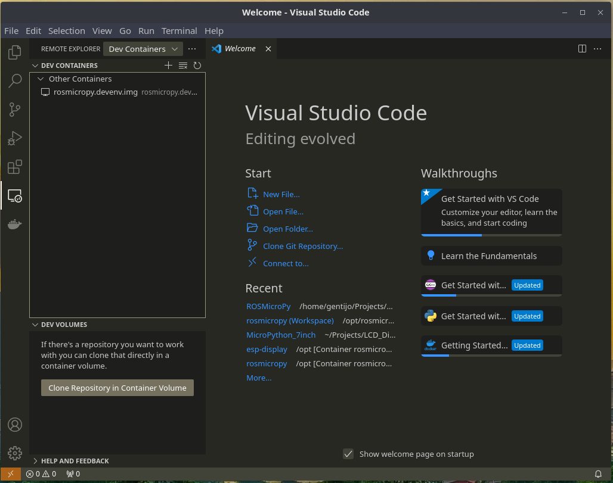
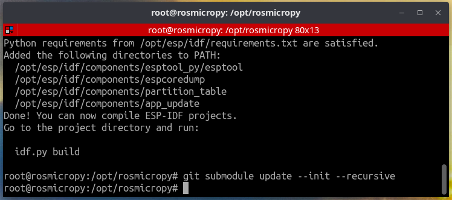
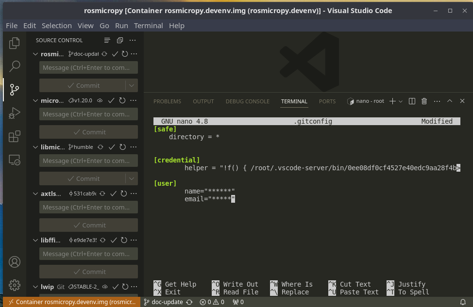
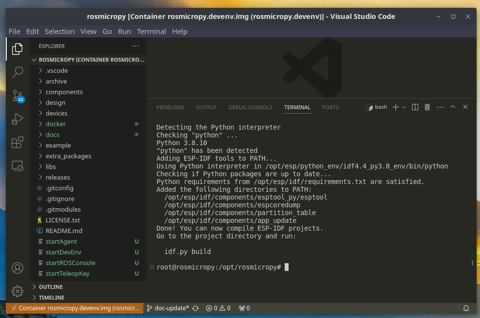
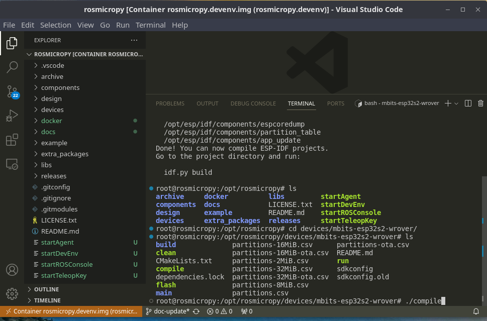
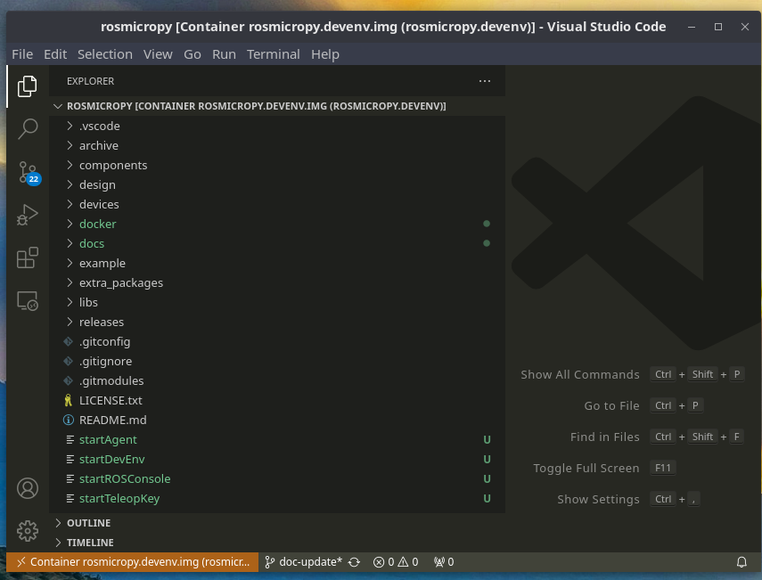

[**First Create the firmware Development Contaier**](../containerSupport/containerDevEnv.md)

[  **Phyiscal Setup**]( ../images/DevEnv_RemExp.png  )

[  **Phyiscal Setup**]( ../images/DevEnv_SubModule.png  )

[  **Phyiscal Setup**]( ../images/DevEnv_UpdateUser.png  )

[  **Phyiscal Setup**]( ../images/DevEnv_VS_Term.png  )

[  **Phyiscal Setup**]( ../images/DevEnv_VS_Term.png  )

[  **Phyiscal Setup**]( ../images/DevEnv_VSC_compile.png )

[  **Phyiscal Setup**]( ../images/DevEnv_VSCode.png )

**sh startDevEnv.sh**  

This will build a docker container with the build environment configured. 

Run the following commands in the container
**source /opt/esp/idf/export.sh**
**cd devices/mbits-esp32s2-wrover**
**sh compile**

If you get an error, cd back to project directory then run
**pip -r pip-requirments.txt**
the cd back to devices/mbits-esp32s2-wrover

if you get a successful compile, you will see the message

*Project build complete. To flash, run this command:
/opt/esp/python_env/idf4.4_py3.8_env/bin/python ../../../esp/idf/components/esptool_py/esptool/esptool.py -p (PORT) -b 460800 --before default_reset --after hard_reset --chip esp32  write_flash --flash_mode dio --flash_size detect --flash_freq 40m 0x1000 build/bootloader/bootloader.bin 0x8000 build/partition_table/partition-table.bin 0x10000 build/mbits-esp32s2-wrover.bin*

**Launch the Thonny IDE**
Select **Run / Select Interperter**
then select **Micropython (ESP32)**
and either auto discover port or select specfic port

In the Thonny IDE you should see the REPL prompt and at this point
run any Python code that you want. 

Load the example code to the device by changing directory of the "This Computer" to you project directory

In the example directory, load all the code including folders to the device by dragging the files from the "This Computer" pane to the "Device" pane below it

If your termonal program supports horiizontal splitting, then run the
following commands in seperate panes, if not the you will need 2 command
windows

To set up the supporting ROS components, in a Terminal run the following from your project directory. the two commands should run 
in seperate panes or windows.

**sh startAgent.sh**

**sh startTeleopKey.sh**

If you are on a linux host, you can also run, in a seperate window/pane

**sh startROSConsole.sh**

This will allow you to run **rqt** in the container which will pop up in a XWindows window on the host computer, rqt is actually running in the container.

Now in the Thonny, from the **Device** pane, double click the **rosEventThread.py** this should bring up the file in the editor.

Click the **run current script** button in the menu bar, you should 
see two different diag messages in the log window on the bottom, 
*in main thread* and *spinning*, spinning is comming from the ROS Stack.

In the terminal window where the Agent is running, you should see messages where the the ESP32 device has registered as a subscriber.

Now in the TeleopKey window, type the arrow keys, you should see a new 
message in the Log window where it says *ROS Did Something* and the data sent from the *cmd_vel* message and displaying the contents of the *Twist* messsage **Graph Explorer**, you will now see the assoiation from the Turtle1 agent to the ESP device.

