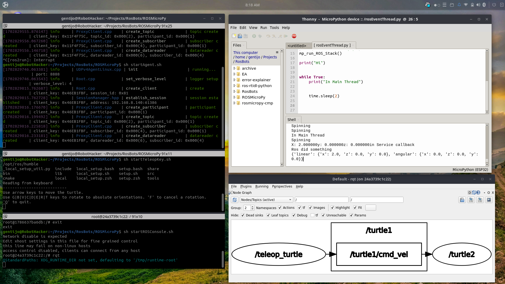

# The Python Development Environment

 A device loaded with ROSMicroPy can opeate as a stand alone device where it can read sensor values and perform operations like turning on a light or fan.  In this Mode, you are only taking advantage of the Micropython section of the project. 
 
 When you start to couple that to the larger ROS system, magic starts to happen because it's both possible to run a simpler setup where a remote control can send messages to operate a remote device as well as participating in a larger installation utilizing more ROS services, or combine a RC remote that performs basic manuevers then in conjunction with a ROS Service
 
 This allows you to start using all the modules available to ROS2
 
 An example of this could beusing Machine Learning to recognize a situation and react as a copilot. ROSMicroPy allows you to grow from small setup targeted to children 10 years old and above and also allow a broad range of expansion to provide follow on growth opportunity for the Python developer interested in robotics.  

 To participate in the ROS network, there are some prerequisites that need to be configured and running to support the whole system. This project has included container definitions that allow the end user to launch these service without needing to learn about the networking of ROS. 

 
### Prerequisites  
- Build and run the [Agent Container](../containerSupport/containerROSAgent.md)

- Build and run the [TeleopKey Container](../containerSupport/containerTeleopKey.md)

- Install and run [Thonny](https://thonny.org/)

### Optional Components
- Build and run the [ROS Console Container](../containerSupport/containerROSConsole.md)

- From the ROS Console, run the [**rqt**](https://wiki.ros.org/rqt) GUI App

### Suggested Screen layout
- Arrange terminals running the required containers, arrange them as a stacked array on the left hand side of the screen. A terminal program that supports splitting the window horizontally, makes window management easier

- Open the Thonny and arrange it on the top right of the screen

- Move the  **rqt** bottom bottom right hand of the screen.

- Sample Python code is located in the [example directory](../../example)

- The sample code can be loaded on the device by dragging it from the top (Local Directory) down to the device directory.
  
- To start the ROS System and register to receive /cmd_vel messages with the data type of geometry_twist 

