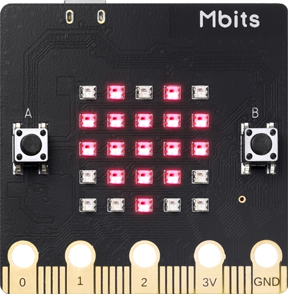
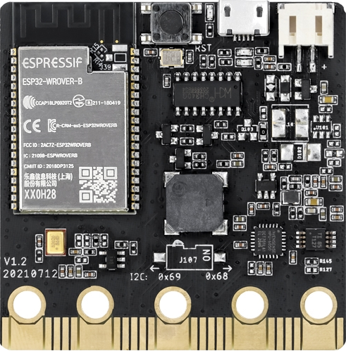

# ROSMicroPy example Python code

## Twisted Example

[TwistedPublisher](./TwistedPublisher.py) and [TwistedSubscriber](./TwistedSubscriber.py)
are parallel examples of the int32-publisher and int32-subscriber that are include with 
MicroROS except that the Type used is a Geometry:Twist message to provide a more complex type to test.

# ESP32 Maqueen Battle Bots

This project consists of MicroROS running on an ESP32 and ROS2 Agent running on a Host computer. 

The ESP32 based Turtle bot consists of off the shelf parts, the Maqueen Turtle bot from [DFRobot](https://www.dfrobot.com/product-1783.html)

  

the [MBits ESP32](https://www.aliexpress.us/item/3256803353734572.html), a [MicroBit](https://microbit.org) form factor ESP32 board, you will need two of these

  
  &nbsp;&nbsp;
  

and the [Joystick Controller](https://www.amazon.com/Elecfreaks-microbit-Joystick-Wireless-Control/dp/B08HD557QJ)

[MBits Wiki](https://www.elecrow.com/wiki/index.php?title=Mbits)

[Code for the Turtle Bot](../python_example_code/RosBot_Maqueen.py)

[Code for the Joystick V2](https://www.amazon.com/Elecfreaks-microbit-Joystick-Wireless-Control/dp/B08HD557QJ)

